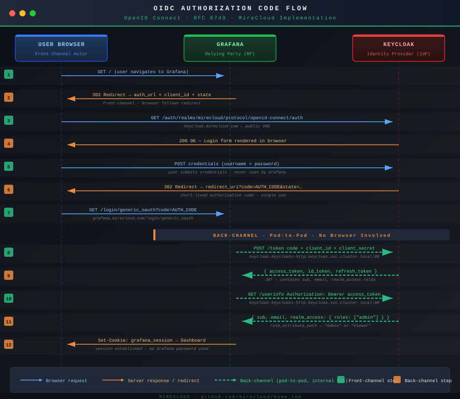

# SSO the Hard Way: Integrating Grafana with Keycloak via OIDC (Part 3)

*MireCloud Series — Eliminating password databases: OpenID Connect, front-channel vs. back-channel, role mapping, and the end of local authentication.*

---

## Overview

Parts 1 and 2 built the foundation: Vault manages all credentials, External Secrets Operator bridges them into Kubernetes, cert-manager automates TLS, and Keycloak runs as a production-grade identity provider with clustered session state.

Part 3 is where that infrastructure proves its value: **integrating Grafana with Keycloak via OpenID Connect** to eliminate Grafana's native login form entirely. By the end, there is no Grafana password database. No local admin account. Every login redirects to Keycloak, authenticates against the central identity layer, and maps realm roles to Grafana permissions automatically.

The deliverables:
- Understanding the OIDC Authorization Code Flow
- Configuring Keycloak as an Identity Provider (IdP)
- Configuring Grafana as a Relying Party (RP)
- Managing the client secret through Vault and ESO
- Front-channel vs. back-channel URL configuration (the detail most guides get wrong)
- Role mapping via JMESPath expressions

---

## A Primer on OpenID Connect

Before diving into YAML, it is worth understanding what OpenID Connect actually does — because every configuration decision that follows is a direct consequence of how the protocol works.

### The Problem It Solves

Without SSO, every service in your cluster has its own user database, its own password policy, its own session management. Add a user, you add them five times. Rotate a password, you rotate it five times. An employee leaves, you hope you remembered to revoke access in all five places.

**OpenID Connect (OIDC)** is an identity layer built on top of OAuth 2.0. It defines a standard protocol by which an application (the **Relying Party**, e.g., Grafana) can delegate authentication to a trusted external service (the **Identity Provider**, e.g., Keycloak). The application never handles passwords. It only receives a verified identity token.

### The Authorization Code Flow

This is the flow used by Grafana when a user attempts to log in:



**Step-by-step breakdown:**

1. **User navigates to Grafana** → `GET /`
2. **Grafana redirects to Keycloak** → `302` with `auth_url` + `client_id` + `state` + `redirect_uri`
3. **Browser follows redirect to Keycloak** → `GET /auth/realms/mirecloud/protocol/openid-connect/auth`
4. **Keycloak renders login form** → User sees username/password fields
5. **User submits credentials** → `POST` to Keycloak (Grafana never sees this)
6. **Keycloak redirects back to Grafana** → `302` with `code=AUTH_CODE` + `state`
7. **Browser follows redirect to Grafana callback** → `GET /login/generic_oauth?code=...`

**From here, the flow switches to back-channel (server-to-server, no browser involved):**

8. **Grafana exchanges code for tokens** (back-channel) → `POST /token` with `code` + `client_id` + `client_secret`
9. **Keycloak returns tokens** → `{ access_token, id_token, refresh_token }`
10. **Grafana requests user info** (back-channel) → `GET /userinfo` with `Authorization: Bearer access_token`
11. **Keycloak returns user claims** → `{ sub, email, realm_access: { roles: ["admin"] } }`
12. **Grafana creates session** → Sets `grafana_session` cookie → User sees dashboard

### Front-Channel vs. Back-Channel

The diagram reveals a critical distinction that most tutorials ignore:

**Front-channel** calls travel through the user's browser as HTTP redirects. The `auth_url` is a front-channel URL — the browser navigates to it directly. It must be publicly reachable: `https://keycloak.mirecloud.com/...`

**Back-channel** calls are made directly between Grafana's pod and Keycloak's pod, inside the Kubernetes cluster. The browser is not involved. These are the token exchange (`token_url`) and user info (`api_url`) calls. They must be reachable from inside the cluster — but they do *not* need to be publicly accessible.

This is why `token_url` in the Grafana configuration uses the internal Kubernetes service DNS name (`keycloak-keycloakx-http.keycloak.svc.cluster.local`) rather than the public hostname. Using the public hostname for back-channel calls works until your cluster's DNS does not resolve external names from inside pods — a common homelab scenario. Using the internal service URL eliminates the dependency entirely.

### Key Concepts

| Term | Role | In this deployment |
|------|------|--------------------|
| Identity Provider (IdP) | Authenticates users, issues tokens | Keycloak |
| Relying Party (RP) | Delegates auth to the IdP | Grafana |
| Client ID | Identifies the RP to the IdP | `grafana` |
| Client Secret | Shared secret between RP and IdP | Stored in Vault at `secret/grafana/sso` |
| Realm | Isolated tenant in Keycloak | `mirecloud` |
| ID Token | JWT containing the user's identity claims | Issued by Keycloak after login |
| Access Token | JWT authorizing API calls on behalf of the user | Used by Grafana for `/userinfo` |

---

## Prerequisites

Before proceeding, verify:

- Keycloak is deployed and accessible at `https://keycloak.mirecloud.com` (Part 2 complete)
- You can log in to the Keycloak admin console with the admin credentials from Vault
- The `ClusterSecretStore` `vault-backend` is in `Valid` state
- Grafana is deployed (we will reconfigure it for OIDC)

---

## Step 1 — Configure Keycloak (One-Time Setup)

The following steps are performed once in the Keycloak admin console:

### Create a Realm

Navigate to the Keycloak admin console → **Create Realm**.

- **Realm name:** `mirecloud`
- **Enabled:** true

Click **Create**.

### Create a Client for Grafana

Inside the `mirecloud` realm, navigate to **Clients** → **Create Client**.

**General Settings:**
- **Client type:** OpenID Connect
- **Client ID:** `grafana`

Click **Next**.

**Capability config:**
- **Client authentication:** ON (this makes it a confidential client)
- **Authorization:** OFF (not needed for this use case)
- **Authentication flow:** Enable "Standard flow"

Click **Next**.

**Login settings:**
- **Valid redirect URIs:** `https://grafana.mirecloud.com/login/generic_oauth`
- **Web origins:** `https://grafana.mirecloud.com`

Click **Save**.

### Retrieve the Client Secret

Navigate to **Clients** → `grafana` → **Credentials** tab.

Copy the **Client Secret** value. This is a long random string generated by Keycloak.

**Store it in Vault immediately:**

```bash
kubectl -n vault exec -ti vault-0 -- vault kv put secret/grafana/sso \
    client_secret='<client-secret-from-keycloak-ui>'
```

This is the only time this value is handled manually. From this point forward, ESO manages its lifecycle.

### Create Realm Roles (Optional)

If you want to map Keycloak roles to Grafana permissions, create roles in the `mirecloud` realm:

Navigate to **Realm roles** → **Create role**.

- **Role name:** `admin`
- **Description:** Grafana Admin access

Repeat for a `viewer` role if desired.

Then assign these roles to users:
Navigate to **Users** → select a user → **Role mapping** → **Assign role** → select `admin`.

---

## Step 2 — ExternalSecret for Grafana

**`infrastructure/monitoring/prometheus-stack/templates/grafana-secret.yaml`**:

```yaml
apiVersion: external-secrets.io/v1
kind: ExternalSecret
metadata:
  name: grafana-keycloak-es
  namespace: monitoring
spec:
  refreshInterval: 1m
  secretStoreRef:
    name: vault-backend
    kind: ClusterSecretStore
  target:
    name: grafana-keycloak-secret
  data:
  - secretKey: client_secret
    remoteRef:
      key: secret/grafana/sso
      property: client_secret
```

This `ExternalSecret` pulls the client secret from Vault and creates a Kubernetes Secret named `grafana-keycloak-secret` in the `monitoring` namespace.

Verify:

```bash
kubectl get externalsecret -n monitoring grafana-keycloak-es
# NAME                   STATUS         READY
# grafana-keycloak-es    SecretSynced   True

kubectl get secret -n monitoring grafana-keycloak-secret
# NAME                       TYPE     DATA   AGE
# grafana-keycloak-secret    Opaque   1      30s
```

---

## Step 3 — Grafana OIDC Configuration

The Grafana configuration is part of the `kube-prometheus-stack` Helm chart values.

**`infrastructure/monitoring/prometheus-stack/values.yaml`** (relevant section):

```yaml
kube-prometheus-stack:
  grafana:
    enabled: true
    envFromSecret: grafana-keycloak-secret  # ESO-managed Secret → env vars in pod

    grafana.ini:
      server:
        domain: grafana.mirecloud.com
        root_url: "https://grafana.mirecloud.com"
        serve_from_sub_path: false

      auth:
        disable_login_form: false       # Keep login form for initial admin access
        oauth_auto_login: false         # Manual redirect to Keycloak

      auth.generic_oauth:
        enabled: true
        name: "Keycloak"
        tls_skip_verify_insecure: true  # Skip TLS verification for internal CA
        client_id: "grafana"
        client_secret: $__env{client_secret}  # Resolved from envFromSecret at runtime

        # ── Front-channel URL ─────────────────────────────────────────────
        # Navigated to by the user's browser. Must use the public hostname.
        auth_url: "https://keycloak.mirecloud.com/auth/realms/mirecloud/protocol/openid-connect/auth"

        # ── Back-channel URLs ─────────────────────────────────────────────
        # Called by the Grafana pod directly. Uses internal cluster DNS.
        # No external DNS resolution required. No TLS to negotiate internally.
        token_url: "http://keycloak-keycloakx-http.keycloak.svc.cluster.local:80/auth/realms/mirecloud/protocol/openid-connect/token"
        api_url:   "http://keycloak-keycloakx-http.keycloak.svc.cluster.local:80/auth/realms/mirecloud/protocol/openid-connect/userinfo"

        scopes: "openid profile email"
        allow_sign_up: true

        # JMESPath expression: maps Keycloak realm roles to Grafana roles
        role_attribute_path: "contains(realm_access.roles[*], 'admin') && 'Admin' || 'Viewer'"
```

**Configuration breakdown:**

**`envFromSecret: grafana-keycloak-secret`** causes Kubernetes to inject all keys in the named Secret as environment variables into the Grafana container. The key `client_secret` (defined in the ExternalSecret target) becomes an environment variable.

**`$__env{client_secret}`** is Grafana's interpolation syntax for reading a value from an environment variable at runtime. The credential travels from Vault to the running config without ever being written in plaintext to a file or a Git-tracked manifest.

**`auth_url`** is the URL the browser navigates to. This must be the public DNS name: `https://keycloak.mirecloud.com/...`

**`token_url` and `api_url`** are called by the Grafana pod directly, not by the browser. These use the internal Kubernetes service DNS: `http://keycloak-keycloakx-http.keycloak.svc.cluster.local:80/...`

The split between public (front-channel) and internal (back-channel) URLs is **not optional**. If you use the public hostname for `token_url`, Grafana must resolve `keycloak.mirecloud.com` from inside the pod. If your cluster DNS doesn't handle external names (common in homelab setups), the token exchange fails with `connection refused` or DNS resolution errors.

**`tls_skip_verify_insecure: true`** is required if your Keycloak certificate is issued by an internal CA that Grafana does not trust by default. In production with a public CA (Let's Encrypt), set this to `false`.

**`role_attribute_path`** is a JMESPath expression evaluated against the JSON payload returned by Keycloak's `/userinfo` endpoint. The expression:

```
contains(realm_access.roles[*], 'admin') && 'Admin' || 'Viewer'
```

Translates to:
- If the user has the `admin` role in the `mirecloud` realm → assign `Admin` in Grafana
- Otherwise → assign `Viewer` in Grafana

To grant admin access, assign the `admin` realm role to the user in the Keycloak console — no changes to the Grafana configuration required.

---

## Step 4 — Deploy the Configuration

```bash
git add infrastructure/monitoring/prometheus-stack/
git commit -m "feat: integrate Grafana with Keycloak OIDC"
git push
```

ArgoCD will sync the changes. Grafana will restart to apply the new configuration.

Verify:

```bash
kubectl get pods -n monitoring -l app.kubernetes.io/name=grafana
# NAME                                          READY   STATUS    RESTARTS   AGE
# prometheus-stack-grafana-xxxxxxxxxx-xxxxx     1/1     Running   0          2m
```

Check Grafana logs for OIDC configuration errors:

```bash
kubectl logs -n monitoring -l app.kubernetes.io/name=grafana | grep -i oauth
```

---

## Step 5 — Test the OIDC Flow

Navigate to `https://grafana.mirecloud.com`.

You should see:
- The standard Grafana login form
- A button: **Sign in with Keycloak**

Click **Sign in with Keycloak**.

The browser redirects to `https://keycloak.mirecloud.com/auth/realms/mirecloud/...`.

Enter the username and password of a user in the `mirecloud` realm.

Keycloak redirects back to `https://grafana.mirecloud.com/login/generic_oauth?code=...`.

Grafana exchanges the authorization code for tokens (back-channel, invisible to you).

You land on the Grafana dashboard. Your role (Admin or Viewer) is determined by whether the Keycloak user has the `admin` realm role.

To verify the role assignment:
- Click your user icon (top-right) → **Profile**
- The role should show as either `Admin` or `Viewer`

---

## Known Issues and Troubleshooting

### Invalid Redirect URI

If Keycloak returns `Invalid redirect_uri` after login, verify that the **Valid Redirect URI** configured in the Keycloak client matches exactly:

```
https://grafana.mirecloud.com/login/generic_oauth
```

Trailing slashes and path differences are treated as mismatches.

### Token Exchange Fails With `connection refused`

This indicates that `token_url` resolves to an unreachable address from inside the Grafana pod.

Confirm the Keycloak service name and namespace:

```bash
kubectl get svc -n keycloak
# NAME                        TYPE           CLUSTER-IP     EXTERNAL-IP
# keycloak-keycloakx-http     LoadBalancer   10.x.x.x       192.168.2.203
```

The `token_url` should use `keycloak-keycloakx-http.keycloak.svc.cluster.local`, not the external IP or public hostname.

### Role Mapping Not Working

If all users land as `Viewer` regardless of their Keycloak roles:

1. Verify the user has the `admin` role assigned in Keycloak:
   - Navigate to **Users** → select user → **Role mapping**
   - The `admin` role should be visible under **Assigned roles**

2. Check the `/userinfo` response from Keycloak:

```bash
# Get an access token (you'll need to perform a full OIDC login first)
curl -X GET \
  'http://keycloak-keycloakx-http.keycloak.svc.cluster.local:80/auth/realms/mirecloud/protocol/openid-connect/userinfo' \
  -H 'Authorization: Bearer <access-token>'
```

The response should include:

```json
{
  "sub": "...",
  "email": "...",
  "realm_access": {
    "roles": ["admin", "offline_access", "uma_authorization"]
  }
}
```

If `realm_access.roles` does not contain `admin`, the role is not assigned correctly in Keycloak.

### Grafana Shows "User Not Found" After Login

This happens when `allow_sign_up: false` and the user does not exist in Grafana's local database.

Set `allow_sign_up: true` to automatically create Grafana users on first OIDC login.

---

## Security Posture

At the completion of this integration:

- No Grafana password database — all authentication delegated to Keycloak
- Client secret managed through Vault and ESO — never visible in Git
- OIDC tokens transmitted securely (TLS on front-channel, internal service mesh for back-channel)
- Role assignment driven by Keycloak realm roles — access control changes do not require Grafana restarts
- Session state isolated to Grafana — revoking a user in Keycloak requires the user to re-authenticate on next Grafana access

---

## Disabling the Native Login Form (Optional)

Once OIDC is confirmed working, you can remove the native Grafana login form entirely:

```yaml
auth:
  disable_login_form: true
  oauth_auto_login: true
```

With these settings:
- Navigating to `https://grafana.mirecloud.com` **immediately redirects** to Keycloak
- The native username/password form is not rendered at all
- Users cannot bypass OIDC to log in with local credentials

**Warning:** Ensure you have an admin user accessible via OIDC before enabling this. If OIDC breaks, you will be locked out of Grafana unless you manually edit the ConfigMap or use `kubectl exec` to reset the config.

---

## What's Next: Part 4

Grafana now authenticates through Keycloak. The next logical step is extending the same pattern to GitLab.

**Part 4** will cover:
- GitLab OIDC configuration with `discovery: false` (required when using internal CAs)
- Explicitly defining all OAuth endpoints (auth, token, userinfo, jwks_uri)
- Injecting the CA certificate into GitLab so it trusts Keycloak's TLS
- Mapping Keycloak groups to GitLab roles
- Storing the full OmniAuth provider configuration as a YAML blob in Vault

Follow me on Medium to be notified when it publishes.

The complete repository is available at [github.com/mirecloud/home_lab](https://github.com/mirecloud/home_lab).

---

*Emmanuel Catin — Senior Platform Engineer | Kubernetes, GitOps, Zero Trust*
*CKA (90%) | CKS in preparation | Montréal, QC*

---

*#Kubernetes #OIDC #Keycloak #Grafana #SSO #OpenIDConnect #GitOps #Vault #ExternalSecrets #DevSecOps #HomeLab #PlatformEngineering #ZeroTrust*
