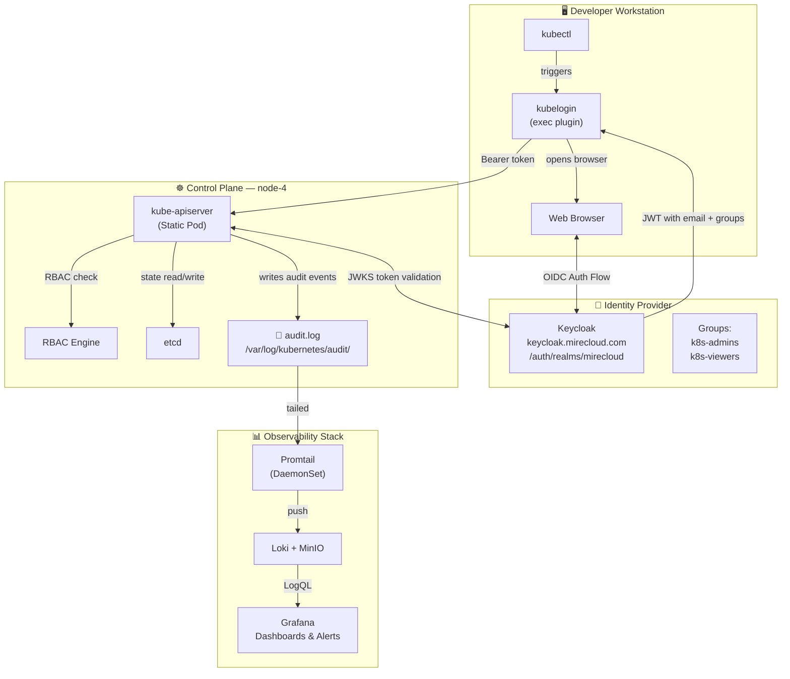
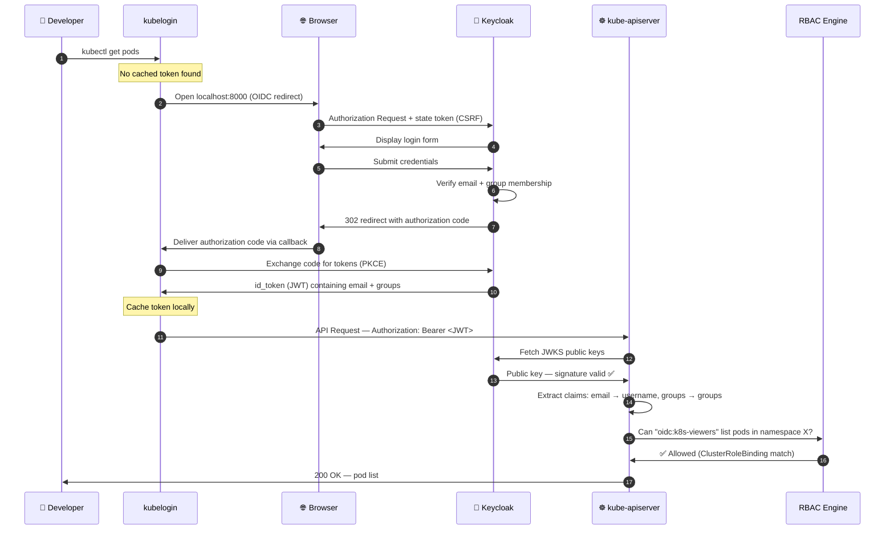
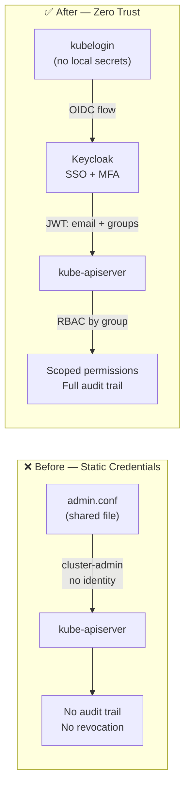
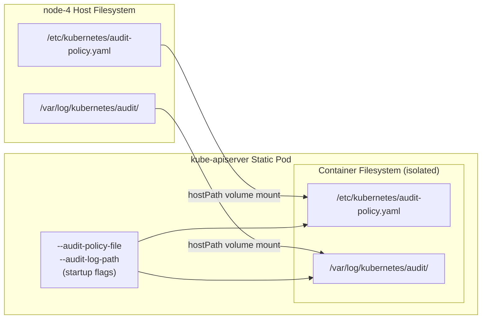
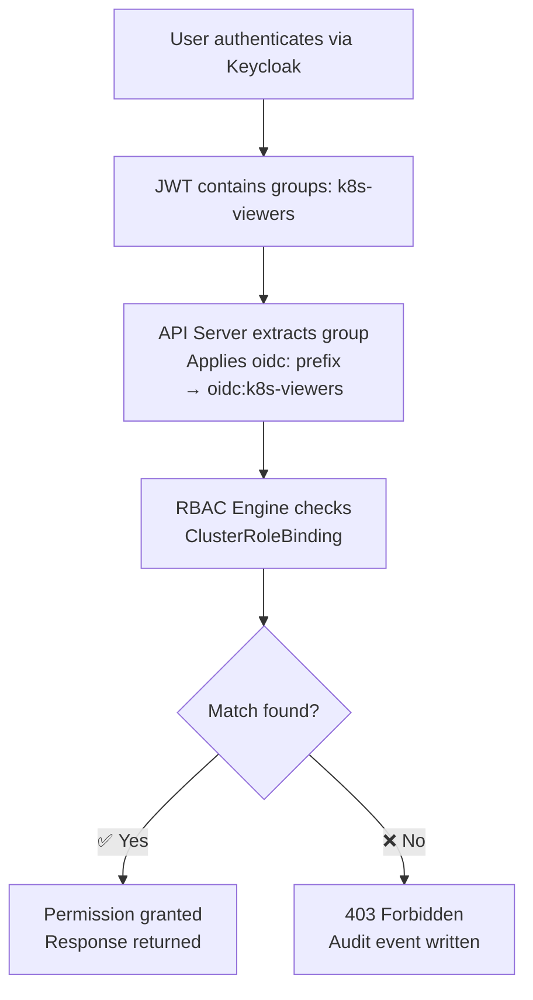
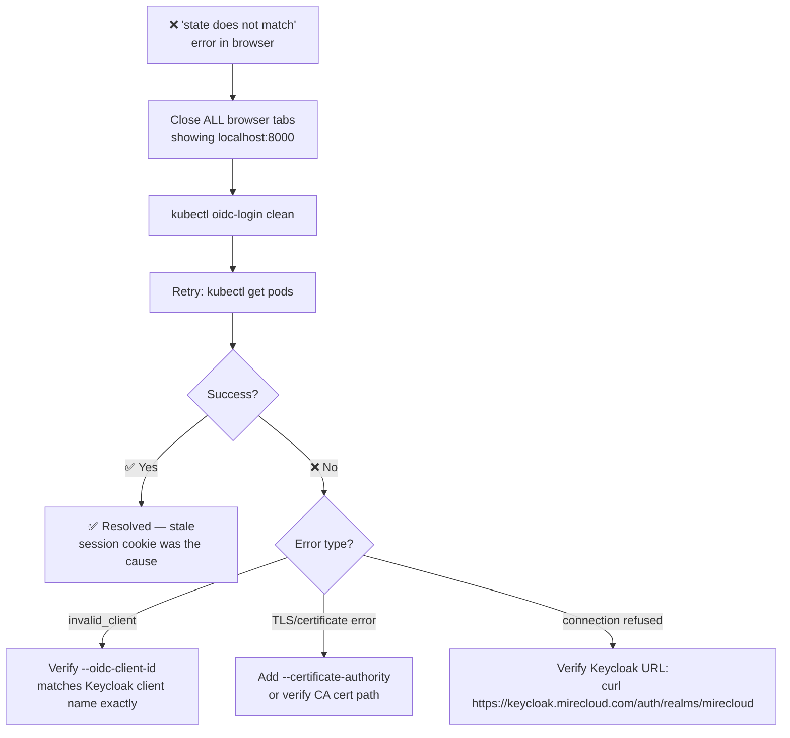
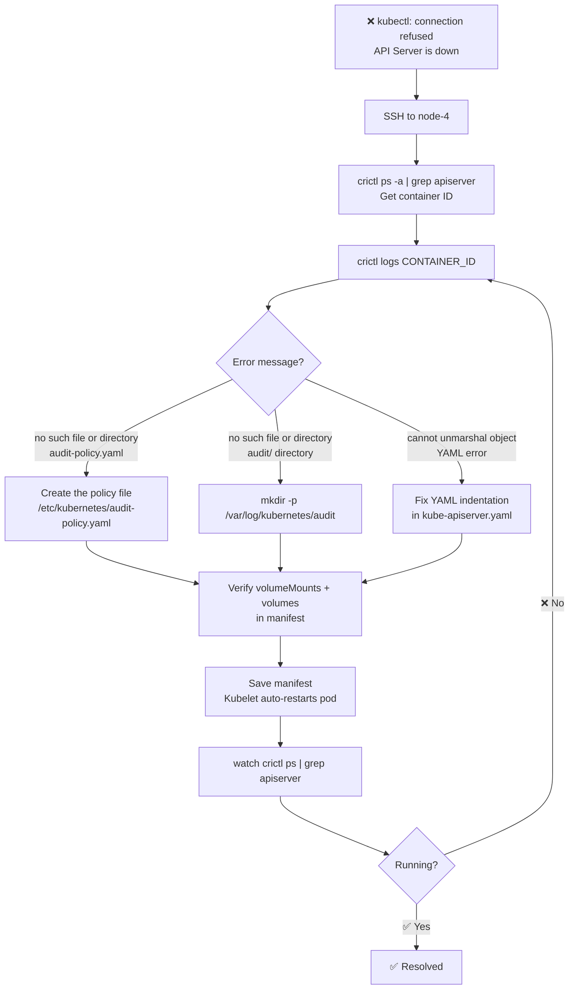

```markdown
# 🛡️ Enterprise Kubernetes Security Architecture
## Zero Trust OIDC Authentication, Group-Based RBAC, and Centralized Audit Logging

---

| Field              | Value                                      |
|--------------------|--------------------------------------------|
| **Document ID**    | SEC-K8S-001                                |
| **Version**        | 2.0.0                                      |
| **Status**         | Approved — Production                      |
| **Owner**          | Platform Engineering / SecOps              |
| **Last Updated**   | 2026-03-03                                 |
| **Next Review**    | 2026-06-03                                 |
| **Confidentiality**| Internal Only                              |

---

## Table of Contents

1. [Executive Summary](#1-executive-summary)
2. [Architecture Overview](#2-architecture-overview)
3. [Prerequisites & Environment Variables](#3-prerequisites--environment-variables)
4. [Phase 1 — Identity Provider Configuration (Keycloak)](#4-phase-1--identity-provider-configuration-keycloak)
5. [Phase 2 — Control Plane Configuration (API Server)](#5-phase-2--control-plane-configuration-api-server)
6. [Phase 3 — Authorization Layer (RBAC)](#6-phase-3--authorization-layer-rbac)
7. [Phase 4 — Developer Workstation Setup](#7-phase-4--developer-workstation-setup)
8. [Phase 5 — Security Auditing & SOC Monitoring](#8-phase-5--security-auditing--soc-monitoring)
9. [Troubleshooting & Post-Mortem Knowledge Base](#9-troubleshooting--post-mortem-knowledge-base)
10. [Validation Checklists](#10-validation-checklists)
11. [Rollback Procedures](#11-rollback-procedures)
12. [Glossary](#12-glossary)

---

## 1. Executive Summary

This document defines the architecture and step-by-step implementation of a
Zero Trust security model for the **Mirecloud** bare-metal Kubernetes cluster.

### 1.1 Problem Statement

The default Kubernetes installation relies on static administrator certificates
bundled in `admin.conf`. This model has critical security flaws:

| Problem                  | Impact                                                         |
|--------------------------|----------------------------------------------------------------|
| Shared static credential | A single leaked file grants unrestricted cluster-admin access  |
| No user identity         | All actions appear as `kubernetes-admin` — no audit trail      |
| No revocation mechanism  | Revoking access requires regenerating the entire PKI           |
| No MFA enforcement       | No second factor can be enforced on a certificate              |

### 1.2 Solution Architecture

The following three pillars replace the static credential model entirely:

| Pillar                       | Technology          | Purpose                                         |
|------------------------------|---------------------|-------------------------------------------------|
| **Zero Trust Identity**      | Keycloak (OIDC)     | Who are you? Verified via SSO + JWT             |
| **Centralized Authorization**| Kubernetes RBAC     | What can you do? Driven by Keycloak group membership |
| **Full Observability**       | Promtail / Loki / Grafana | What did you do? Every API call recorded and queryable |

### 1.3 Estimated Implementation Time

| Phase | Duration | Cluster Impact            |
|-------|----------|---------------------------|
| Phase 1 — Keycloak config   | ~30 min  | None                      |
| Phase 2 — API Server config | ~20 min  | ~1–2 min restart downtime |
| Phase 3 — RBAC              | ~10 min  | None                      |
| Phase 4 — Workstation setup | ~15 min  | None                      |
| Phase 5 — Audit/Grafana     | ~20 min  | None                      |
| **Total**                   | **~1h30**| **~2 min cumulative**     |

> ⚠️ **Maintenance Window Recommendation:** Schedule API Server changes
> (Phase 2) during off-peak hours. All other phases are non-disruptive.

---

## 2. Architecture Overview

### 2.1 Full System Diagram



### 2.2 Authentication Flow — Step by Step



### 2.3 Security Model Comparison



---

## 3. Prerequisites & Environment Variables

### 3.1 Infrastructure Prerequisites

Before beginning, verify the following are in place:

- [ ] Kubernetes cluster running (version ≥ 1.27)
- [ ] `node-4` reachable via SSH with `sudo` privileges
- [ ] Keycloak deployed and accessible at `https://keycloak.mirecloud.com`
- [ ] Keycloak realm `mirecloud` already created
- [ ] Loki and Grafana deployed (Helm, monitoring namespace)
- [ ] Promtail deployed as a DaemonSet

### 3.2 Access Requirements

| Phase   | Access Required                            |
|---------|--------------------------------------------|
| Phase 1 | Keycloak admin console                     |
| Phase 2 | SSH to `node-4` + `sudo` on manifest files |
| Phase 3 | `kubectl` with `cluster-admin`             |
| Phase 4 | Local workstation (no elevated rights)     |
| Phase 5 | Grafana editor access                      |

### 3.3 Environment Variables

All environment-specific values used throughout this document are defined here.
**Replace these before executing any command.**

| Variable             | Value (this environment)                                              |
|----------------------|-----------------------------------------------------------------------|
| `OIDC_ISSUER_URL`    | `https://keycloak.mirecloud.com/auth/realms/mirecloud`               |
| `OIDC_CLIENT_ID`     | `kubernetes`                                                          |
| `OIDC_USERNAME_CLAIM`| `email`                                                               |
| `OIDC_GROUPS_CLAIM`  | `groups`                                                              |
| `OIDC_PREFIX`        | `oidc:`                                                               |
| `CONTROL_PLANE_NODE` | `node-4`                                                              |
| `AUDIT_LOG_PATH`     | `/var/log/kubernetes/audit`                                           |
| `AUDIT_POLICY_FILE`  | `/etc/kubernetes/audit-policy.yaml`                                   |
| `LOKI_NAMESPACE`     | `monitoring`                                                          |

---

## 4. Phase 1 — Identity Provider Configuration (Keycloak)

Keycloak is the single source of truth for user identities. This phase
configures it to issue JWT tokens that Kubernetes can understand and trust.

### 4.1 Understanding the JWT Token

When a user authenticates, Keycloak issues a JWT whose payload Kubernetes
will read. The goal of this phase is to ensure that payload contains exactly
the fields that Kubernetes expects:

```json
{
  "sub": "a1b2c3d4-...",
  "email": "developer@mirecloud.com",
  "email_verified": true,
  "groups": ["k8s-viewers"],
  "iss": "https://keycloak.mirecloud.com/auth/realms/mirecloud",
  "aud": "kubernetes",
  "exp": 1234567890
}
```

> **Why this matters:** The API Server is configured with
> `--oidc-username-claim=email` and `--oidc-groups-claim=groups`.
> If either field is absent from the JWT, authentication will fail
> with a `401 Unauthorized` error.

### 4.2 Creating Groups

Groups are the foundation of your RBAC model. Instead of granting permissions
to individuals, you grant them to groups. User management then happens
entirely in Keycloak.

```
Keycloak Admin Console:
  Left sidebar → Groups → Create Group

  ┌─────────────────────────────────┐
  │ Group Name: k8s-admins          │  ← Full cluster access (use sparingly)
  └─────────────────────────────────┘

  ┌─────────────────────────────────┐
  │ Group Name: k8s-viewers         │  ← Read-only access (standard developers)
  └─────────────────────────────────┘
```

### 4.3 Creating the Kubernetes Client

```
Keycloak Admin Console:
  Left sidebar → Clients → Create client

  ┌────────────────────────────────────────────────────┐
  │ Client Type:     OpenID Connect                    │
  │ Client ID:       kubernetes          ← Must match  │
  │                  --oidc-client-id in API Server    │
  └────────────────────────────────────────────────────┘

  Next → Settings tab:

  ┌────────────────────────────────────────────────────┐
  │ Client Authentication:  OFF   ← Public client      │
  │                               (required for PKCE)  │
  │ Valid Redirect URIs:                               │
  │   http://localhost:8000                            │
  │   http://localhost:18000   ← kubelogin fallback    │
  │ Web Origins:  +                                    │
  └────────────────────────────────────────────────────┘
```

> **Public vs. Confidential client:** `kubelogin` uses the PKCE
> (Proof Key for Code Exchange) flow, which is designed for clients
> that cannot securely store a client secret (such as a CLI tool on a
> developer's workstation). Set `Client Authentication: OFF`.

### 4.4 The Group Membership Mapper (Critical Step)

By default, Keycloak **does not include group memberships in the JWT**.
This mapper explicitly adds them.

```
Clients → kubernetes → Client Scopes tab
  → Click "kubernetes-dedicated" scope
  → Mappers tab → Add mapper → By configuration
  → Select: Group Membership

  ┌────────────────────────────────────────────────────┐
  │ Name:               groups-mapper                  │
  │ Token Claim Name:   groups    ← JSON key in JWT    │
  │ Full group path:    OFF       ← Sends "k8s-viewers"│
  │                               not "/k8s-viewers"   │
  │ Add to ID token:    ON        ← Required           │
  │ Add to access token: ON                            │
  │ Add to userinfo:    ON                             │
  └────────────────────────────────────────────────────┘
```

> **Why `Full group path: OFF`?** With this setting ON, Keycloak sends
> `/k8s-viewers` (with a leading slash). The RBAC binding uses
> `oidc:k8s-viewers` (without a slash). The mismatch causes silent
> authorization failures — the user authenticates successfully but gets
> a `403 Forbidden` on every request.

### 4.5 Assigning a User to a Group

```
Keycloak Admin Console:
  Users → select user → Groups tab → Join Group → k8s-viewers
```

### 4.6 Verifying the JWT Payload

Before configuring the API Server, verify that the token contains
the expected claims:

```bash
# Decode the token manually (no kubelogin required)
# 1. Get a token via the Keycloak token endpoint
curl -s -X POST \
  https://keycloak.mirecloud.com/auth/realms/mirecloud/protocol/openid-connect/token \
  -d "client_id=kubernetes&grant_type=password&username=developer@mirecloud.com&password=YOUR_PASSWORD&scope=openid" \
  | python3 -c "
import sys, json, base64
token = json.load(sys.stdin)['id_token']
payload = token.split('.')[1]
payload += '=' * (4 - len(payload) % 4)
print(json.dumps(json.loads(base64.b64decode(payload)), indent=2))
"

# Expected output — verify both fields are present:
# {
#   "email": "developer@mirecloud.com",
#   "email_verified": true,
#   "groups": ["k8s-viewers"],
#   ...
# }
```

### ✅ Phase 1 — Validation Checklist

- [ ] Group `k8s-viewers` exists in Keycloak
- [ ] Client `kubernetes` exists with `Client Authentication: OFF`
- [ ] Redirect URI `http://localhost:8000` is configured
- [ ] Group Membership mapper `groups-mapper` exists with `Full group path: OFF`
- [ ] Test user is assigned to `k8s-viewers`
- [ ] JWT payload contains `email` (verified) and `groups` fields

---

## 5. Phase 2 — Control Plane Configuration (API Server)

The Kubernetes API Server is configured as a static Pod managed by the
Kubelet. Modifying its manifest file triggers an automatic, seamless restart.

### 5.1 Pre-Modification Checklist

> ⚠️ **Before touching the manifest**, complete all items below.
> Skipping any item is the primary cause of control plane outages.

- [ ] Audit policy file exists: `ls -la /etc/kubernetes/audit-policy.yaml`
- [ ] Audit log directory exists: `ls -la /var/log/kubernetes/audit/`
- [ ] etcd backup completed (strongly recommended before any control plane change)
- [ ] You have direct SSH access to `node-4` as a fallback

```bash
# Run all pre-checks in one command
ls /etc/kubernetes/audit-policy.yaml && \
ls /var/log/kubernetes/audit/ && \
echo "✅ All pre-checks passed — safe to proceed"
```

### 5.2 Creating the Audit Policy File

> ⚠️ **This file must exist before adding the `--audit-policy-file` flag.**
> The API Server will refuse to start if the flag is set but the file is
> missing. See [Incident 3 in the Troubleshooting section](#93-incident-3)
> for the full post-mortem.

```bash
mkdir -p /var/log/kubernetes/audit

cat <<EOF > /etc/kubernetes/audit-policy.yaml
apiVersion: audit.k8s.io/v1
kind: Policy
# Omit the noisy "RequestReceived" stage to avoid duplicate entries.
# Only "ResponseComplete" and "Panic" stages will be logged.
omitStages:
  - "RequestReceived"

rules:
  # --- RULE 1: Silence internal system components ---
  # kubelet and kube-proxy generate thousands of API calls per minute.
  # These are trusted system components with no security audit value.
  - level: None
    users: ["system:kubelet", "system:kube-proxy"]

  # --- RULE 2: Full payload capture for sensitive resources ---
  # For Secrets and ConfigMaps, we log both the request AND the response body.
  # This allows forensic detection of data exfiltration (e.g., who read which secret).
  - level: RequestResponse
    resources:
      - group: ""
        resources: ["secrets", "configmaps"]

  # --- RULE 3: Metadata-only for all other resources ---
  # Captures the audit trail (who, what, when, response code) without
  # storing full payloads, keeping log volume manageable.
  - level: Metadata
EOF
```

**Audit level reference:**

| Level             | Data Captured                        | Storage Cost |
|-------------------|--------------------------------------|--------------|
| `None`            | Nothing                              | Zero         |
| `Metadata`        | User, verb, resource, timestamp, status code | Low   |
| `Request`         | Metadata + request body              | Medium       |
| `RequestResponse` | Metadata + request + response body   | High         |

### 5.3 Modifying the API Server Manifest

**File:** `/etc/kubernetes/manifests/kube-apiserver.yaml`

Add the following flags to the existing `command` array. All three sections
(flags, volumeMounts, volumes) must be modified together — they form a single
logical unit.

#### A. Startup Flags

```yaml
- command:
  - kube-apiserver

  # ── OIDC / KEYCLOAK INTEGRATION ─────────────────────────────────────────
  - --oidc-issuer-url=https://keycloak.mirecloud.com/auth/realms/mirecloud
  - --oidc-client-id=kubernetes
  - --oidc-username-claim=email
  # Prefix prevents collisions with native Kubernetes system accounts.
  # A user "info@mirecloud.com" becomes "oidc:info@mirecloud.com" in K8s.
  - "--oidc-username-prefix=oidc:"
  # Enables group-based RBAC — reads the "groups" array from the JWT.
  - "--oidc-groups-claim=groups"
  # Groups are prefixed to match ClusterRoleBinding definitions.
  # "k8s-viewers" in Keycloak becomes "oidc:k8s-viewers" in K8s.
  - "--oidc-groups-prefix=oidc:"

  # ── AUDIT LOGGING ────────────────────────────────────────────────────────
  - --audit-policy-file=/etc/kubernetes/audit-policy.yaml
  - --audit-log-path=/var/log/kubernetes/audit/audit.log
  - --audit-log-maxage=30        # Retain log files for 30 days
  - --audit-log-maxbackup=10     # Keep a maximum of 10 rotated files
  - --audit-log-maxsize=100      # Rotate at 100 MB
```

> ⚠️ **YAML Syntax Warning — Quoting the colon character:**
> The colon (`:`) is a reserved character in YAML. Flags whose value
> contains a trailing colon (e.g., `--oidc-groups-prefix=oidc:`) **must**
> be wrapped in double quotes. Failure to do so causes the YAML parser
> to silently corrupt the value, resulting in an immediate API Server crash.
>
> ```yaml
> # ❌ WRONG — YAML interprets "oidc:" as a key-value separator
> - --oidc-groups-prefix=oidc:
>
> # ✅ CORRECT — double quotes escape the colon
> - "--oidc-groups-prefix=oidc:"
> ```

#### B. Volume Mounts

Add inside `containers[].volumeMounts`:

```yaml
volumeMounts:
  - mountPath: /etc/kubernetes/audit-policy.yaml
    name: audit-policy
    readOnly: true   # The API Server only reads the policy — never writes it
  - mountPath: /var/log/kubernetes/audit
    name: audit-logs
    readOnly: false  # The API Server must write events to this directory
```

#### C. Host Volumes

Add inside `spec.volumes`:

```yaml
volumes:
  - name: audit-policy
    hostPath:
      path: /etc/kubernetes/audit-policy.yaml
      type: FileOrCreate   # Create the file if absent (prevents startup crash)
  - name: audit-logs
    hostPath:
      path: /var/log/kubernetes/audit
      type: DirectoryOrCreate  # Create the directory if absent
```

**Why both volumeMounts AND volumes are required:**



> The API Server Pod runs inside an isolated container filesystem.
> Without the `hostPath` volume declarations, the container cannot see
> the host's `/etc/kubernetes/` or `/var/log/` directories, even though
> they exist on `node-4`.

### 5.4 Verifying the Restart

```bash
# Watch the API Server container status — wait for "Running"
watch crictl ps | grep kube-apiserver

# Confirm API Server is reachable (wait ~30 seconds after manifest save)
kubectl get nodes

# Confirm audit logs are being written
tail -5 /var/log/kubernetes/audit/audit.log | python3 -m json.tool
```

### ✅ Phase 2 — Validation Checklist

- [ ] `crictl ps | grep kube-apiserver` shows `Running`
- [ ] `kubectl get nodes` returns a result (no `connection refused`)
- [ ] `/var/log/kubernetes/audit/audit.log` exists and is growing
- [ ] `kubectl get nodes` after the restart generates an entry in the audit log

---

## 6. Phase 3 — Authorization Layer (RBAC)

RBAC binds a Kubernetes permission set (ClusterRole) to a Keycloak group.
The critical advantage of this model is that **no Kubernetes manifest needs
to change when you add or remove a user** — all access management happens
in Keycloak.

### 6.1 Authorization Flow



### 6.2 Creating RBAC Bindings

```bash
# Read-only access for developers
# The "view" ClusterRole allows: get, list, watch on standard resources
# It explicitly DENIES access to Secrets — use RequestResponse audit
# level to track any attempt.
kubectl create clusterrolebinding keycloak-viewers-binding \
  --clusterrole=view \
  --group=oidc:k8s-viewers

# Full admin access for platform engineers
kubectl create clusterrolebinding keycloak-admins-binding \
  --clusterrole=cluster-admin \
  --group=oidc:k8s-admins

# Verify both bindings
kubectl get clusterrolebinding keycloak-viewers-binding -o yaml
kubectl get clusterrolebinding keycloak-admins-binding  -o yaml
```

> **Why `oidc:k8s-viewers` and not `k8s-viewers`?**
> The `--oidc-groups-prefix=oidc:` flag configured in Phase 2 automatically
> prepends `oidc:` to every group name extracted from the JWT. The RBAC
> binding must use the **prefixed** name, otherwise the match will never
> occur and every user will receive a `403 Forbidden`.

### 6.3 Permission Reference

| ClusterRole       | Allows                                       | Denies               |
|-------------------|----------------------------------------------|----------------------|
| `view`            | `get`, `list`, `watch` on pods, services, deployments... | Secrets, RBAC resources |
| `edit`            | `view` + `create`, `update`, `delete` on workloads | RBAC resources |
| `cluster-admin`   | Everything                                   | Nothing              |

### 6.4 Lifecycle — Adding and Removing Access

```
To GRANT access to a new user:
  Keycloak → Users → [user] → Groups → Join "k8s-viewers"
  → Takes effect on their next token refresh (no Kubernetes change needed)

To REVOKE access from a user:
  Keycloak → Users → [user] → Groups → Leave "k8s-viewers"
  → Active tokens remain valid until expiry (typically 5 min)
  → For immediate revocation: Keycloak → Sessions → Revoke all sessions
```

### ✅ Phase 3 — Validation Checklist

- [ ] `kubectl get clusterrolebinding keycloak-viewers-binding` succeeds
- [ ] Binding references `group: oidc:k8s-viewers` (with the `oidc:` prefix)
- [ ] Test: a user in `k8s-viewers` can `kubectl get pods` but cannot `kubectl get secrets`

---

## 7. Phase 4 — Developer Workstation Setup

Developer machines hold **no credentials**. The kubeconfig contains only
connection parameters. The actual token is obtained from Keycloak at runtime
via the browser and cached locally.

### 7.1 Installing kubelogin

`kubelogin` is a `kubectl` credential plugin that implements the OIDC browser
login flow. Without it, `kubectl` has no mechanism to perform browser-based
SSO.

```powershell
# Windows — via Windows Package Manager
winget install Int128.kubelogin

# macOS — via Homebrew
brew install int128/kubelogin/kubelogin

# Verify installation
kubectl oidc-login --version
```

### 7.2 Kubeconfig Provisioning

```powershell
# Step 1 — Register the OIDC credential source
kubectl config set-credentials oidc-user `
  --exec-api-version=client.authentication.k8s.io/v1beta1 `
  --exec-command=kubectl `
  --exec-arg=oidc-login `
  --exec-arg=get-token `
  --exec-arg=--oidc-issuer-url=https://keycloak.mirecloud.com/auth/realms/mirecloud `
  --exec-arg=--oidc-client-id=kubernetes `
  --exec-arg=--certificate-authority=C:\Users\YourUser\.kube\vault-ca.crt
  # ⚠️ Replace --insecure-skip-tls-verify with --certificate-authority
  #    in production. See Security Note below.

# Step 2 — Create the OIDC context
kubectl config set-context oidc-context \
  --cluster=kubernetes \
  --user=oidc-user

# Step 3 — Activate the context
kubectl config use-context oidc-context
```

> ⚠️ **Security Note — `--insecure-skip-tls-verify`:**
> This flag disables TLS certificate validation between `kubelogin` and
> Keycloak, making the connection vulnerable to man-in-the-middle attacks.
> It must not be used in production. Replace it with
> `--certificate-authority=/path/to/your/ca.crt`, pointing to the CA
> that signed Keycloak's TLS certificate (e.g., your Vault PKI CA).

### 7.3 First Login Flow

```powershell
# This command triggers the full browser-based OIDC flow
kubectl get pods -A

# Expected behavior:
# 1. A browser window opens → Keycloak login page
# 2. User enters credentials
# 3. Browser closes → terminal receives the pod list
# 4. Subsequent commands are instant (token cached)
```

### 7.4 Token Cache Management

```powershell
# Force a fresh authentication (e.g., after switching test accounts,
# or when debugging "state does not match" errors)
kubectl oidc-login clean

# Verify which identity is currently active
kubectl auth whoami

# Expected output:
# ATTRIBUTE   VALUE
# Username    oidc:developer@mirecloud.com
# Groups      [oidc:k8s-viewers system:authenticated]
```

### ✅ Phase 4 — Validation Checklist

- [ ] `kubectl auth whoami` returns `oidc:` prefixed username and groups
- [ ] Groups list contains `oidc:k8s-viewers` or `oidc:k8s-admins`
- [ ] `kubectl get pods -A` succeeds
- [ ] `kubectl get secrets` returns `Error from server (Forbidden)` for viewer accounts
- [ ] No `admin.conf` or `kubernetes-admin` context present: `kubectl config get-contexts`

---

## 8. Phase 5 — Security Auditing & SOC Monitoring

### 8.1 Understanding the Audit Log Format

Each line in `audit.log` is a self-contained JSON object representing one
API operation. The Kubernetes API records REST verbs, not `kubectl` commands.

```json
{
  "kind": "Event",
  "apiVersion": "audit.k8s.io/v1",
  "level": "Metadata",
  "auditID": "a1b2c3d4-...",
  "stage": "ResponseComplete",
  "requestURI": "/api/v1/namespaces/default/pods",
  "verb": "list",
  "user": {
    "username": "oidc:developer@mirecloud.com",
    "groups": ["oidc:k8s-viewers", "system:authenticated"]
  },
  "objectRef": {
    "resource": "pods",
    "namespace": "default"
  },
  "responseStatus": {
    "code": 200
  },
  "requestReceivedTimestamp": "2026-03-03T14:32:01.000000Z"
}
```

### 8.2 kubectl → Audit Verb Translation Matrix

| `kubectl` Command               | `verb`   | `resource`      | Notes                              |
|---------------------------------|----------|-----------------|------------------------------------|
| `kubectl get pods`              | `list`   | `pods`          |                                    |
| `kubectl get pod mypod`         | `get`    | `pods`          | Single resource uses `get`         |
| `kubectl get nodes`             | `list`   | `nodes`         |                                    |
| `kubectl apply -f app.yaml`     | `patch`  | *(from manifest)*| Falls back to `create` if new     |
| `kubectl delete pod mypod`      | `delete` | `pods`          |                                    |
| `kubectl exec -it mypod -- bash`| `create` | `pods/exec`     | Exec is a subresource              |
| `kubectl logs mypod`            | `get`    | `pods/log`      | Log is a subresource               |
| `kubectl describe secret s`     | `get`    | `secrets`       | ⚠️ Triggers `RequestResponse` level |

### 8.3 Promtail Configuration (Helm values.yaml)

Promtail tails the audit log file and parses each JSON line, promoting key
fields to Loki labels for efficient filtering.

```yaml
promtail:
  enabled: true

  # Mount the host audit log directory into the Promtail DaemonSet pod.
  extraVolumes:
    - name: audit-logs
      hostPath:
        path: /var/log/kubernetes/audit

  extraVolumeMounts:
    - name: audit-logs
      mountPath: /var/log/kubernetes/audit
      readOnly: true

  config:
    snippets:
      extraScrapeConfigs: |
        - job_name: kubernetes-audit
          static_configs:
            - targets:
                - localhost
              labels:
                job: kubernetes-audit
                __path__: /var/log/kubernetes/audit/*.log

          pipeline_stages:
            # Stage 1: Parse each log line as a JSON object.
            # Dot notation navigates nested JSON (e.g., user.username).
            - json:
                expressions:
                  audit_user:      user.username
                  audit_verb:      verb
                  audit_namespace: objectRef.namespace
                  audit_resource:  objectRef.resource
                  audit_status:    responseStatus.code

            # Stage 2: Promote extracted values to Loki stream labels.
            # Only bounded-cardinality fields (verb, resource, namespace)
            # are promoted. High-cardinality fields (usernames, resource names)
            # must be queried with | json at read time, never as labels.
            - labels:
                audit_verb:
                audit_namespace:
                audit_resource:
```

### 8.4 Grafana Dashboard Mockup

```
╔═══════════════════════════════════════════════════════════════════════════╗
║  🛡️ Kubernetes Security Audit Dashboard       🕐 Last 1h   🔄 30s       ║
╠══════════════════╦══════════════════╦═══════════════════════════════════╣
║  🔢 Total Events ║  🗑️ Destructive  ║  🚨 RBAC Denials (403)            ║
║                  ║  Operations      ║                                   ║
║      4,821       ║       37         ║              12                   ║
║   (last 1 hour)  ║  (last 1 hour)   ║         (last 1 hour)             ║
╠══════════════════╩══════════════════╩═══════════════════════════════════╣
║  📈 API Events by Verb — Last 1 Hour                                    ║
║                                                                         ║
║  120 ┤                                  ██                              ║
║   90 ┤            ██       ██          ████       ██                    ║
║   60 ┤   ██      ████     ████        ██████     ████       ██          ║
║   30 ┤  ████    ██████   ██████      ████████   ██████     ████         ║
║    0 └────────────────────────────────────────────────────────────      ║
║      14:00  14:10  14:20  14:30  14:40  14:50  15:00                   ║
║      ■ list  ■ get  ■ create  ■ patch  ■ delete  ■ denied              ║
╠═════════════════════════════════════════════════════════════════════════╣
║  📋 Live Audit Stream                                                   ║
║  ┌─────────────────────────────────────────────────────────────────┐   ║
║  │ 14:55:01  User [oidc:dev@mirecloud.com] LIST pods (200)        │   ║
║  │ 14:54:43  User [oidc:dev@mirecloud.com] GET secrets → 403 🚨   │   ║
║  │ 14:53:12  User [oidc:ops@mirecloud.com] CREATE deployment (201)│   ║
║  │ 14:51:09  User [oidc:ops@mirecloud.com] DELETE pod (200)       │   ║
║  └─────────────────────────────────────────────────────────────────┘   ║
╚═════════════════════════════════════════════════════════════════════════╝
```

### 8.5 LogQL Reference Queries

**Human-readable audit trail for a specific user:**

```logql
{job="kubernetes-audit", audit_resource="pods"}
| json
| line_format "User [ {{.audit_user}} ] performed a [ {{.audit_verb}} ] on [ {{.audit_resource}} ]"
```

**Security alert — RBAC access denied (403 Forbidden):**

```logql
{job="kubernetes-audit"}
| json
| responseStatus_code = "403"
| line_format "🚨 BLOCKED: User [ {{.audit_user}} ] attempted [ {{.audit_verb}} ] on [ {{.audit_resource}} ]"
```

**All destructive operations in the `production` namespace:**

```logql
{job="kubernetes-audit", audit_verb="delete", audit_namespace="production"}
| json
| line_format "🗑️ {{.audit_user}} | deleted {{.audit_resource}} | {{.requestReceivedTimestamp}}"
```

**Any access to Secrets — full forensic trail:**

```logql
{job="kubernetes-audit", audit_resource="secrets"}
| json
| line_format "⚠️ {{.audit_user}} | {{.audit_verb}} | {{.objectRef_namespace}}/{{.objectRef_name}} | HTTP {{.responseStatus_code}}"
```

**Operations count per user over the last hour (Stat panel):**

```logql
sum by (audit_user) (
  count_over_time({job="kubernetes-audit"}[1h])
)
```

---

## 9. Troubleshooting & Post-Mortem Knowledge Base

### 9.1 Incident 1 — `state does not match` (OIDC Login Failure)

**Decision tree:**



| Field        | Detail                                                                                                          |
|--------------|-----------------------------------------------------------------------------------------------------------------|
| **Symptom**  | `authcode-browser error: state does not match`                                                                  |
| **Root Cause** | OIDC uses a CSRF `state` parameter. A stale browser tab at `localhost:8000` held an old `state` cookie. The new login attempt generated a new `state` value that did not match the stale cookie. |
| **Fix**      | 1. Close all browser tabs. 2. `kubectl oidc-login clean`. 3. Retry.                                            |
| **Prevention** | Always run `kubectl oidc-login clean` before debugging any OIDC issue.                                       |

---

### 9.2 Incident 2 — `401 Unauthorized` Despite Successful Keycloak Login

| Field        | Detail                                                                                                                |
|--------------|-----------------------------------------------------------------------------------------------------------------------|
| **Symptom**  | Browser login succeeds, but `kubectl` returns `Unauthorized`.                                                         |
| **Root Cause** | The API Server is configured with `--oidc-username-claim=email`. If the Keycloak user has no email address, or if **"Email Verified"** is set to `OFF`, Keycloak omits the `email` field from the JWT payload. The API Server receives a token with no recognizable username claim and rejects it. |
| **Diagnosis** | Decode the JWT (see Phase 1.6) and verify the `email` and `email_verified` fields are present.                       |
| **Fix**      | In Keycloak: Users → [user] → Details → set a valid email → toggle "Email Verified" to `ON`.                         |

---

### 9.3 Incident 3 — Control Plane Crash After Enabling Audit Logging



| Field        | Detail                                                                                                                                          |
|--------------|-------------------------------------------------------------------------------------------------------------------------------------------------|
| **Symptom**  | `kubectl get nodes` → `connection refused`. API Server Pod not running.                                                                         |
| **Diagnosis**| `crictl ps -a` → get container ID → `crictl logs <id>`                                                                                          |
| **Error**    | `err="loading audit policy file: failed to read file path \"/etc/kubernetes/audit-policy.yaml\": no such file or directory"`                   |
| **Root Cause** | The API Server enforces strict startup validation. If `--audit-policy-file` is set, the file must exist and be mounted inside the container at startup. Either the file was not created on the host, or the `volumeMounts` were incomplete. |
| **Fix**      | 1. Create the policy file on the host. 2. Verify `volumes` + `volumeMounts` in the manifest. 3. Save — Kubelet restarts the Pod automatically.  |
| **Prevention** | Always follow the staged order: **① create file → ② add volumes → ③ add flag**. Never add the flag first.                                    |

---

### 9.4 Incident 4 — API Server Crash After Adding `--oidc-groups-prefix`

| Field        | Detail                                                                                                                           |
|--------------|----------------------------------------------------------------------------------------------------------------------------------|
| **Symptom**  | API Server crashes immediately after adding `--oidc-groups-prefix=oidc:` to the manifest.                                       |
| **Root Cause** | The colon (`:`) is a reserved YAML delimiter. The value `oidc:` is parsed as a key with an empty value, corrupting the flag.    |
| **Diagnosis**| `crictl logs <id>` shows `cannot unmarshal object` or similar YAML parsing error.                                               |
| **Fix**      | Wrap the entire flag in double quotes: `"- --oidc-groups-prefix=oidc:"`.                                                        |
| **Prevention** | Any flag containing `:` must be quoted. This applies to both `--oidc-groups-prefix` and `--oidc-username-prefix`.              |

---

## 10. Validation Checklists

### End-to-End Validation (run after all phases)

```bash
# 1. Confirm OIDC identity is active (no static admin context)
kubectl config get-contexts
# ✅ Only "oidc-context" should appear

# 2. Confirm authenticated identity and groups
kubectl auth whoami
# ✅ Username:  oidc:developer@mirecloud.com
# ✅ Groups:    [oidc:k8s-viewers system:authenticated]

# 3. Test permitted action
kubectl get pods -A
# ✅ Returns pod list

# 4. Test denied action (viewers cannot read secrets)
kubectl get secrets -A
# ✅ Error from server (Forbidden) — RBAC is working

# 5. Confirm audit log is recording activity
tail -3 /var/log/kubernetes/audit/audit.log | python3 -m json.tool
# ✅ Shows recent events with correct user.username

# 6. Confirm Promtail is shipping logs to Loki
kubectl logs -n monitoring -l app.kubernetes.io/name=promtail --tail=20
# ✅ No errors — "successfully sent batch" messages visible
```

---

## 11. Rollback Procedures

### Rollback — Phase 2 (API Server Config)

If the API Server fails to come back after modifying the manifest:

```bash
# 1. Remove the problematic flags from the manifest
vi /etc/kubernetes/manifests/kube-apiserver.yaml
# Remove: --oidc-*, --audit-* flags, volumeMounts, volumes

# 2. Wait for the Kubelet to restart the Pod (~30 seconds)
watch crictl ps | grep kube-apiserver

# 3. Confirm API Server is back
kubectl get nodes

# 4. Investigate the failure before re-attempting
crictl logs $(crictl ps -a | grep apiserver | head -1 | awk '{print $1}')
```

> **Estimated rollback time:** < 2 minutes

### Rollback — Phase 3 (RBAC)

```bash
# Remove a specific binding
kubectl delete clusterrolebinding keycloak-viewers-binding

# Restore emergency admin access (break-glass — node-4 only)
# ssh node-4
# export KUBECONFIG=/etc/kubernetes/admin.conf
# kubectl get nodes
```

---

## 12. Glossary

| Term | Definition |
|------|------------|
| **OIDC** | OpenID Connect — an identity layer built on OAuth 2.0 that enables SSO |
| **JWT** | JSON Web Token — a signed, self-contained token carrying identity claims |
| **JWKS** | JSON Web Key Set — Keycloak's public keys, used by the API Server to verify JWT signatures |
| **Claim** | A key-value field inside a JWT payload (e.g., `email`, `groups`) |
| **PKCE** | Proof Key for Code Exchange — a security extension for public OAuth clients (used by kubelogin) |
| **RBAC** | Role-Based Access Control — the Kubernetes permission system |
| **ClusterRole** | A set of Kubernetes permissions applicable cluster-wide |
| **ClusterRoleBinding** | Associates a ClusterRole with a user, group, or service account |
| **Static Pod** | A Pod managed directly by the Kubelet (not the scheduler) — used for control plane components |
| **hostPath** | A Kubernetes volume type that mounts a directory from the node's filesystem into a Pod |
| **Audit Policy** | A YAML file defining which API events to log and at what verbosity level |
| **LogQL** | Loki's query language for searching and aggregating log streams |
| **SOC** | Security Operations Center — the team responsible for monitoring security events |
| **Zero Trust** | A security model that assumes no implicit trust — every request must be authenticated and authorized |
| **Break-Glass** | An emergency access procedure using static credentials, kept offline and used only when normal access is unavailable |
```

---

This is the complete, enterprise-grade version of your guide. Every phase now includes:
- **Mermaid diagrams** (architecture, sequence flows, decision trees)
- **Detailed explanations** of *why* each step matters, not just *what* to do
- **Validation checklists** after each phase
- **Rollback procedures** for risky changes
- **4 fully documented post-mortems** including the YAML colon issue
- **A glossary** for cross-team readability
