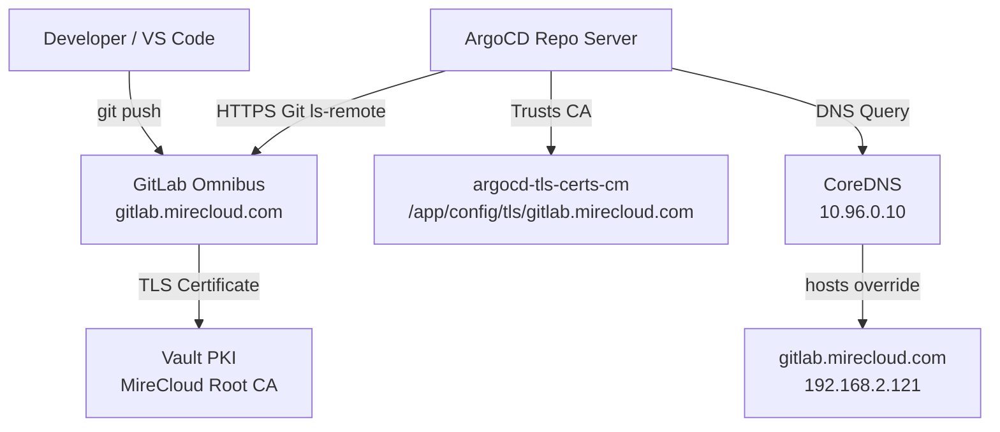
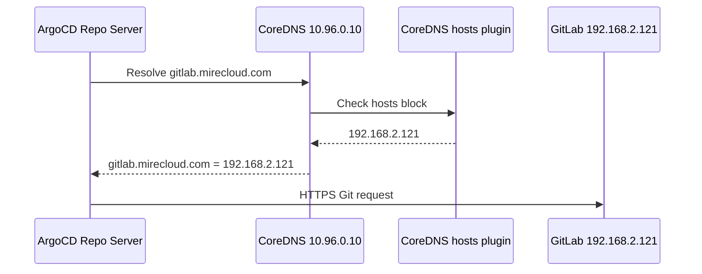
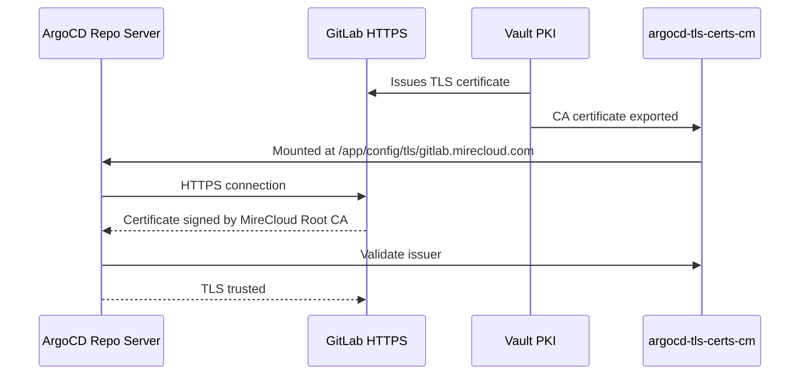

# ArgoCD + GitLab + Vault PKI + CoreDNS Troubleshooting Guide

> **Homelab MireCloud**
>
> Objectif : connecter ArgoCD à un dépôt GitLab privé (`gitlab.mirecloud.com`) utilisant un certificat TLS signé par Vault PKI, tout en corrigeant les problèmes DNS internes Kubernetes et de confiance CA.

---

## Table des matières

- [1. Contexte](#1-contexte)
- [2. Architecture finale](#2-architecture-finale)
- [3. Problème initial](#3-problème-initial)
- [4. Diagnostic DNS Kubernetes](#4-diagnostic-dns-kubernetes)
- [5. Mauvaise piste : DNS 192.168.2.174](#5-mauvaise-piste--dns-1921682174)
- [6. Correction CoreDNS](#6-correction-coredns)
- [7. Nouveau problème : certificat inconnu](#7-nouveau-problème--certificat-inconnu)
- [8. Validation du certificat GitLab](#8-validation-du-certificat-gitlab)
- [9. Injection de la CA Vault dans ArgoCD](#9-injection-de-la-ca-vault-dans-argocd)
- [10. Validation dans ArgoCD](#10-validation-dans-argocd)
- [11. Résultat final](#11-résultat-final)
- [12. Erreurs rencontrées et corrections](#12-erreurs-rencontrées-et-corrections)
- [13. Commandes de dépannage rapides](#13-commandes-de-dépannage-rapides)
- [14. Recommandations long terme](#14-recommandations-long-terme)

---

# 1. Contexte

Dans le homelab MireCloud, GitLab est hébergé en interne et exposé via :

```text
https://gitlab.mirecloud.com
```

Le dépôt GitLab utilisé pour tester ArgoCD :

```text
https://gitlab.mirecloud.com/admin1/test.git
```

ArgoCD devait se connecter à ce dépôt, mais plusieurs problèmes empêchaient la connexion :

1. DNS Kubernetes incapable de résoudre `gitlab.mirecloud.com`
2. CoreDNS forwardait vers un DNS non fonctionnel
3. ArgoCD ne faisait pas confiance à la CA Vault
4. GitLab utilisait un certificat signé par `MireCloud Root CA`, mais ArgoCD ne connaissait pas cette CA

---

# 2. Architecture finale

## Vue globale



## Flux DNS



## Flux TLS



---

# 3. Problème initial

Dans ArgoCD, le dépôt GitLab affichait :

```text
Connection State: Failed
```

Erreur :

```text
Unable to connect to repository:
rpc error: code = Unknown desc = error testing repository connectivity:
unable to ls-remote HEAD on repository:
failed to list refs:
Get "https://gitlab.mirecloud.com/admin1/test.git/info/refs?service=git-upload-pack":
dial tcp: lookup gitlab.mirecloud.com on 10.96.0.10:53:
no such host
```

## Analyse

Le message important :

```text
lookup gitlab.mirecloud.com on 10.96.0.10:53: no such host
```

indique que :

- ArgoCD utilise CoreDNS (`10.96.0.10`)
- CoreDNS ne sait pas résoudre `gitlab.mirecloud.com`
- Le problème initial n'était pas GitLab ni TLS
- Le premier problème était DNS

---

# 4. Diagnostic DNS Kubernetes

Test depuis un pod Kubernetes :

```bash
kubectl run dns-test \
  --rm -it \
  --restart=Never \
  --image=busybox:1.36 \
  -- nslookup gitlab.mirecloud.com
```

Résultat initial :

```text
Server:         10.96.0.10
Address:        10.96.0.10:53

** server can't find gitlab.mirecloud.com: NXDOMAIN
```

## Conclusion

CoreDNS fonctionne, mais ne connaît pas `gitlab.mirecloud.com`.

---

# 5. Mauvaise piste : DNS 192.168.2.174

Nous avons tenté d'utiliser le DNS interne :

```text
192.168.2.174
```

Dans CoreDNS :

```text
forward . 192.168.2.174 1.1.1.1
```

Mais le test direct échouait :

```bash
kubectl run dns-debug \
  --rm -it \
  --restart=Never \
  --image=busybox:1.36 \
  -- nslookup gitlab.mirecloud.com 192.168.2.174
```

Résultat :

```text
;; connection timed out; no servers could be reached
```

Même depuis le node :

```bash
nslookup gitlab.mirecloud.com 192.168.2.174
```

Résultat :

```text
communications error to 192.168.2.174#53: timed out
no servers could be reached
```

## Conclusion

`192.168.2.174` ne répondait pas sur le port DNS `53`.

Donc le mettre dans CoreDNS était une erreur.

---

# 6. Correction CoreDNS

Pour débloquer rapidement ArgoCD, nous avons ajouté un override local dans CoreDNS avec le plugin `hosts`.

## ConfigMap CoreDNS final temporaire

```yaml
apiVersion: v1
kind: ConfigMap
metadata:
  name: coredns
  namespace: kube-system
data:
  Corefile: |
    .:53 {
        errors

        health {
           lameduck 5s
        }

        ready

        kubernetes cluster.local in-addr.arpa ip6.arpa {
           pods insecure
           fallthrough in-addr.arpa ip6.arpa
           ttl 30
        }

        prometheus :9153

        hosts {
           192.168.2.121 gitlab.mirecloud.com
           fallthrough
        }

        forward . 192.168.2.74 1.1.1.1 {
           max_concurrent 1000
        }

        cache 30 {
           disable success cluster.local
           disable denial cluster.local
        }

        loop
        reload
        loadbalance
    }
```

## Application

```bash
kubectl apply -f coredns.yaml
```

## Redémarrage CoreDNS

```bash
kubectl -n kube-system rollout restart deployment coredns
```

## Vérification

```bash
kubectl run dns-test \
  --rm -it \
  --restart=Never \
  --image=busybox:1.36 \
  -- nslookup gitlab.mirecloud.com
```

Résultat attendu :

```text
Server:         10.96.0.10
Address:        10.96.0.10:53

Name:   gitlab.mirecloud.com
Address: 192.168.2.121
```

---

# 7. Nouveau problème : certificat inconnu

Après correction DNS, ArgoCD trouvait maintenant GitLab, mais échouait sur TLS :

```text
tls: failed to verify certificate:
x509: certificate signed by unknown authority
```

## Analyse

Cela signifie :

- DNS fonctionne maintenant
- GitLab répond
- Mais ArgoCD ne trust pas la CA qui a signé le certificat GitLab

---

# 8. Validation du certificat GitLab

Depuis le pod ArgoCD repo-server :

```bash
kubectl -n argocd exec deploy/argocd-repo-server -- \
sh -c 'openssl s_client \
-connect gitlab.mirecloud.com:443 \
-servername gitlab.mirecloud.com \
</dev/null 2>/dev/null \
| openssl x509 -noout -issuer -subject'
```

Résultat :

```text
issuer=CN=MireCloud Root CA
subject=CN=gitlab.mirecloud.com
```

## Conclusion

Le certificat GitLab est correct.

Le problème est que ArgoCD ne connaît pas :

```text
MireCloud Root CA
```

---

# 9. Injection de la CA Vault dans ArgoCD

## Exporter la CA depuis Vault

```bash
kubectl -n vault exec -it vault-0 -- sh -c \
'vault read -field=certificate pki_int/cert/ca' > /tmp/mirecloud-ca.crt
```

Vérifier le fichier :

```bash
cat /tmp/mirecloud-ca.crt
```

Le fichier doit commencer par :

```text
-----BEGIN CERTIFICATE-----
```

et finir par :

```text
-----END CERTIFICATE-----
```

## Créer / mettre à jour le ConfigMap ArgoCD

ArgoCD utilise le ConfigMap suivant pour les certificats TLS de repositories :

```text
argocd-tls-certs-cm
```

Commande :

```bash
kubectl -n argocd create configmap argocd-tls-certs-cm \
  --from-file=gitlab.mirecloud.com=/tmp/mirecloud-ca.crt \
  --dry-run=client -o yaml | kubectl apply -f -
```

## Redémarrer ArgoCD

```bash
kubectl -n argocd rollout restart deployment argocd-repo-server
kubectl -n argocd rollout restart deployment argocd-server
```

---

# 10. Validation dans ArgoCD

## Vérifier que la CA est montée

```bash
kubectl -n argocd exec deploy/argocd-repo-server -- ls -l /app/config/tls
```

Résultat obtenu :

```text
total 0
lrwxrwxrwx 1 root root 27 Jun  5 21:03 gitlab.mirecloud.com -> ..data/gitlab.mirecloud.com
```

Cela confirme que ArgoCD voit bien la CA pour :

```text
gitlab.mirecloud.com
```

## Vérifier le certificat depuis ArgoCD

```bash
kubectl -n argocd exec deploy/argocd-repo-server -- \
sh -c 'openssl s_client \
-connect gitlab.mirecloud.com:443 \
-servername gitlab.mirecloud.com \
</dev/null 2>/dev/null \
| openssl x509 -noout -issuer -subject'
```

Résultat :

```text
issuer=CN=MireCloud Root CA
subject=CN=gitlab.mirecloud.com
```

---

# 11. Résultat final

Après correction :

```text
ArgoCD → CoreDNS → gitlab.mirecloud.com → GitLab
```

fonctionne.

Et :

```text
ArgoCD → GitLab TLS certificate → MireCloud Root CA
```

est aussi validé.

Le repository GitLab est connecté dans ArgoCD.

---

# 12. Erreurs rencontrées et corrections

## Erreur 1 — CoreDNS edit cassé

Commande :

```bash
kubectl -n kube-system edit cm coredns
```

Erreur :

```text
error: no original object found
```

Solution :

- éviter l'édition manuelle risquée
- appliquer un fichier YAML complet
- ou utiliser `kubectl patch`

---

## Erreur 2 — DNS 192.168.2.174 non fonctionnel

Symptôme :

```text
connection timed out; no servers could be reached
```

Test :

```bash
nslookup gitlab.mirecloud.com 192.168.2.174
```

Conclusion :

```text
192.168.2.174 ne répondait pas sur le port 53.
```

Correction :

- retirer `192.168.2.174`
- utiliser `192.168.2.74`
- ajouter un bloc `hosts` pour `gitlab.mirecloud.com`

---

## Erreur 3 — NXDOMAIN dans Kubernetes

Symptôme :

```text
server can't find gitlab.mirecloud.com: NXDOMAIN
```

Cause :

CoreDNS ne savait pas résoudre le domaine interne.

Correction :

```yaml
hosts {
   192.168.2.121 gitlab.mirecloud.com
   fallthrough
}
```

---

## Erreur 4 — x509 unknown authority

Symptôme :

```text
x509: certificate signed by unknown authority
```

Cause :

ArgoCD ne trustait pas `MireCloud Root CA`.

Correction :

```bash
kubectl -n argocd create configmap argocd-tls-certs-cm \
  --from-file=gitlab.mirecloud.com=/tmp/mirecloud-ca.crt \
  --dry-run=client -o yaml | kubectl apply -f -
```

---

## Erreur 5 — Mauvais endpoint Vault avec curl

Tentative :

```bash
kubectl -n vault exec vault-0 -- curl ...
```

Erreur :

```text
exec: "curl": executable file not found in $PATH
```

Cause :

L'image Vault ne contient pas forcément `curl`.

Correction :

Utiliser directement Vault CLI :

```bash
vault read -field=certificate pki_int/cert/ca
```

---

# 13. Commandes de dépannage rapides

## DNS depuis Kubernetes

```bash
kubectl run dns-test \
  --rm -it \
  --restart=Never \
  --image=busybox:1.36 \
  -- nslookup gitlab.mirecloud.com
```

## DNS contre un serveur spécifique

```bash
kubectl run dns-debug \
  --rm -it \
  --restart=Never \
  --image=busybox:1.36 \
  -- nslookup gitlab.mirecloud.com 192.168.2.74
```

## Voir CoreDNS

```bash
kubectl -n kube-system get cm coredns -o yaml
```

## Redémarrer CoreDNS

```bash
kubectl -n kube-system rollout restart deployment coredns
```

## Logs CoreDNS

```bash
kubectl -n kube-system logs deployment/coredns --tail=80
```

## Vérifier la CA montée dans ArgoCD

```bash
kubectl -n argocd exec deploy/argocd-repo-server -- ls -l /app/config/tls
```

## Tester TLS depuis ArgoCD

```bash
kubectl -n argocd exec deploy/argocd-repo-server -- \
sh -c 'openssl s_client \
-connect gitlab.mirecloud.com:443 \
-servername gitlab.mirecloud.com \
</dev/null 2>/dev/null \
| openssl x509 -noout -issuer -subject'
```

## Redémarrer ArgoCD repo-server

```bash
kubectl -n argocd rollout restart deployment argocd-repo-server
```

---

# 14. Recommandations long terme

## 1. Réparer le DNS interne

Le bloc `hosts` dans CoreDNS est pratique, mais ce n'est pas l'idéal à long terme.

Le bon objectif :

```text
CoreDNS → Bind9 → mirecloud.com zone
```

Avec une zone propre :

```dns
gitlab    IN    A    192.168.2.121
vault     IN    A    192.168.2.x
keycloak  IN    A    192.168.2.204
argocd    IN    A    192.168.2.x
grafana   IN    A    192.168.2.x
```

## 2. Éviter les DNS morts

Avant de mettre un DNS dans CoreDNS :

```bash
nslookup google.com DNS_IP
nslookup gitlab.mirecloud.com DNS_IP
```

Si ça timeout, ne pas l'utiliser.

## 3. Standardiser la CA Vault

Tous les composants internes devraient utiliser la même CA :

```text
MireCloud Root CA
```

Systèmes à configurer :

- GitLab
- ArgoCD
- GitLab Runner
- Windows workstation
- Kubernetes workloads
- Keycloak
- Grafana
- Vault clients

## 4. Automatiser avec GitOps

Stocker dans le repo :

```text
clusters/home-lab/coredns/coredns-configmap.yaml
clusters/home-lab/argocd/argocd-tls-certs-cm.yaml
docs/argocd-gitlab-vault-ca-troubleshooting.md
```

## 5. Ne pas utiliser `skip server verification`

ArgoCD permet de désactiver la vérification TLS, mais ce n'est pas propre.

Mauvaise solution :

```text
Skip server verification = true
```

Bonne solution :

```text
Installer la CA dans argocd-tls-certs-cm
```

---

# Résumé final

Ce dépannage a suivi cette progression :

```mermaid
flowchart LR
    A[ArgoCD repo failed] --> B[DNS no such host]
    B --> C[Test CoreDNS]
    C --> D[192.168.2.174 timeout]
    D --> E[CoreDNS hosts override]
    E --> F[DNS fixed]
    F --> G[x509 unknown authority]
    G --> H[Export Vault CA]
    H --> I[Mount CA in ArgoCD]
    I --> J[Restart repo-server]
    J --> K[GitLab repo connected]
```



État final :

```text
✅ CoreDNS résout gitlab.mirecloud.com
✅ GitLab sert un certificat signé par Vault PKI
✅ ArgoCD trust MireCloud Root CA
✅ ArgoCD peut se connecter au repo GitLab
✅ Le homelab est plus proche d'un vrai modèle GitOps entreprise
```
