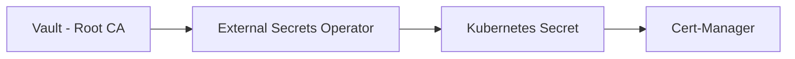

# Documentation Technique : Infrastructure PKI sur Kubernetes

**Projet :** Home Lab Mirecloud  
**Type :** LAB – Gem personnalisée  
**Date :** 20 décembre 2025  
**Sujet :** Gestion sécurisée des certificats et secrets (Vault, External Secrets, Cert-Manager)

---

## 1. Vue d’ensemble – Architecture de sécurité

Cette infrastructure met en place une chaîne PKI complète permettant de gérer les certificats TLS (HTTPS) sans jamais stocker de clés privées dans Git.

### Flux de données logique



### Les 3 piliers de l’infrastructure

| Composant | Analogie | Rôle technique |
|---------|---------|---------------|
| Vault | Banque centrale | Stocke la Root CA (clé privée + certificat) |
| External Secrets | Convoyeur blindé | Synchronise les secrets de Vault vers Kubernetes |
| Cert-Manager | Imprimerie | Génère et renouvelle les certificats TLS |

---

## 2. Détail des composants

### A. HashiCorp Vault

- Namespace : `vault`
- Mode Seal / Unseal
- 5 clés, 3 requises
- Chemin : `secret/mirecloud/ca`
- Contenu : `tls.crt`, `tls.key`

---

### B. External Secrets Operator

- Authentification via ServiceAccount Kubernetes
- Aucun secret stocké en clair
- Synchronisation automatique

---

### C. Cert-Manager

- Gestion du cycle de vie TLS
- Utilisation d’un ClusterIssuer basé sur un secret généré dynamiquement

---

## 3. Validation finale

```bash
kubectl delete secret mirecloud-ca-key-pair -n cert-manager
kubectl get secret mirecloud-ca-key-pair -n cert-manager
```

Le secret est recréé automatiquement, preuve que la chaîne PKI est fonctionnelle.
